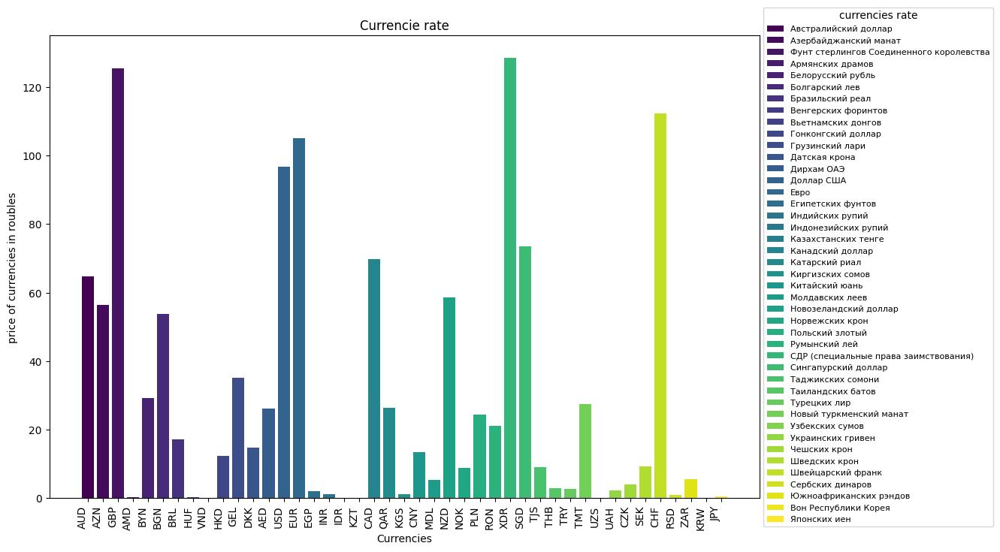

## Отчет по Лабораторной работе №5
 **Лабораторная работа 5. Работа с валютами. Шаблон «одиночка»**

 ---- 
 выполнил: *Маковеев Никита Владимирович*

 ----

 В ходе данной работы было необходимо написать код, который позволяет получать значения курсов валют с сайта ЦБ РФ в объектно-ориентированном стиле. Реализовать шаблон проектирования "одиночка"(Singleton), чтобы нельзя было создать больше чем один объект данного класса. Одиночка должен быть реализован с помощью метаклассов. Основа - метод get_currencies.

1. Был создан класс Currencies в стиле Одиночка
2. Данный класс реализует все необходимые методы и атрибуты задания. 
   +  атрибут `_cur_dict`: Содержит словарь содержащий основную информацию об курсах валют, получен через парсинг XML полученного от ЦБ РФ.
   +  атрибут `_time_pause`: Обозначает минимальную паузу между запросами
   +  атрибут `_url`: url ЦБ РФ
   +  Каждый атрибут имеет свои функции set и get
   +  метод `parse_xml`: Выполняет `get` запрос к интернет ресурсу по атрибуту `_url`. Предполагает получение XML в ответ и преобразует его в словарь(dict). И возвращает этот словарь.
   +  метод `get_currencies`: Возвращает информацию об курсе валют в виде словаря. Вызывает метод `parse_xml`, если результат не `None`, то устанавливает новый словарь в качестве атрибута `_cur_dict`.
   +  метод `visualize_currencies`: Строит гистограмму по сохраненому курсу валют. И сохраняет изображение в папку images. Ниже приведен пример построенной гистограммы. **Важно:** перед созданием графика необходимо хоть раз вызвать метод `get_currencies`

## Комментарий Жукова
Сделать вывод определенных акций.